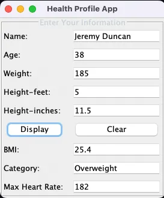

## CIS355A Week 2 Lab—Developing an OOP GUI Application

<!-- screenshot of app -->

### Objectives
* Create a GUI that uses JTextField, JLabel, and JButton.
* Write event handlers to process user data.

Problem: Health Profile App
GymsRUs would like to replace their console program with an updated app using a graphical user interface. You will use the HealthProfile class that you created in the Week 1 Lab and build a GUI for it.

### Functional Requirements
It is easy to reuse code from the old project. For the Week 2 Lab, you will need to copy the HealthProfile class to this week’s project by doing the following.
* Open the Week 1 Lab project.
* Open the source packages folder.
* Right-click on the HealthProfile.java file and click copy.
* Go to the Week 2 Lab project.
* Open the source packages folder.
* Right-click and choose Paste  Refactor Copy.

#### Your project will have two classes.
* HealthProfile class from Week 1 Lab
* HealthProfileGUI class (which contains the main method)

#### Your HealthProfildGUI class should have the following components. (See sample GUI below.)
* JTextField objects to enter name, age, height in feet, height in inches, weight in pounds
* JButton objects to display results, clear the GUI
* JTextField objects to display the BMI, category, and max heart rate
* JLabels to describe all textboxes

#### You are free to layout and design your GUI as you like if it includes these components.
Add default and parameterized constructors to your HealthProfile class. 
The parameterized constructor should have five arguments: the name, age, weight, height in feet, and height in inches. 

Note, it should convert the height to inches to store in the private instance variable.
Code event handlers for each button.

* Display: Make sure all user input is present and valid.

* Use the HealthProfile class to process the data.

* Display the results on the GUI.

* Clear	Clear all text boxes on the GUI.